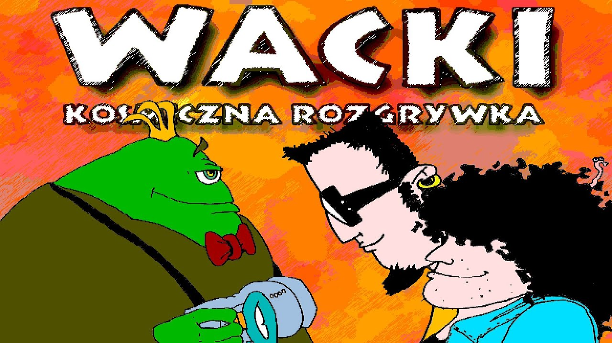

# Wacki: Kosmiczna rozgrywka

A portable port of **Wacki: Kosmiczna rozgrywka** (1998) — a Polish
point-and-click adventure. The game is in Polish, set in Poland, and
was made in Poland; for that reason the rest of this README is in
Polish too.



## O grze

**Wacki: Kosmiczna rozgrywka** to polska gra przygodowa typu
point-and-click, wydana 1 lipca 1998 roku przez studio
Seven Stars Multimedia na komputery z systemem Microsoft Windows.

Akcja rozgrywa się na polskim osiedlu, gdzie dwaj nastolatkowie —
Franc i Edek — spotykają kosmitę Aargha. Obcy prosi ich o pomoc
w odnalezieniu części zagubionego urządzenia **ACME** (Atomowego
Czasoprzestrzennego Modyfikatora Energii), które uległo rozpadowi.
Gracz steruje dwoma bohaterami, eksplorując kolejne lokacje na
osiedlu i rozwiązując zagadki — klika myszą na obiekty i postacie,
zbiera przedmioty, prowadzi dialogi. Gra zawiera liczne elementy
humorystyczne, często opierające się na polskiej kulturze i
absurdalnych sytuacjach.

Niniejszy projekt jest portem silnika gry — odtworzonym ze
zdekompilowanej oryginalnej binarki `WACKI.EXE`. Repozytorium
**nie zawiera materiałów z gry**; aby zagrać, potrzebna jest własna
kopia oryginalnej płyty.

## Status portu

Port jest funkcjonalnie kompletny — gra przechodzi się od intro
do napisów końcowych z większością mechanik i detali oryginału:
sterowanie dwoma postaciami, system dialogów i dymków, ekwipunek,
zapis i wczytanie stanu (sloty + quick save / quick load), pełna
animacja postaci i obiektów, dźwięk (muzyka, SFX, kwestie mówione),
intra i cutscenki AVI, panel z paskiem życia, menu opcji.

Szczegóły techniczne — jak silnik działa pod maską, format danych,
maszyna wirtualna skryptów, dekoder animacji FLIC, pipeline audio
itd. — znajdują się w katalogu [`docs/`](docs/). To dokumentacja
**budowy gry**, nie roadmapa portu.

---

## Wersja PC (macOS / Linux / Windows)

### Wymagania

- gotowa binarka portu z zakładki [Releases](../../releases) — dla
  docelowej platformy:
  - macOS (Apple Silicon)
  - Linux x86_64
  - Windows 10/11 x86_64
- pliki danych z oryginalnej płyty: `Dane_*.dta`

### Uruchomienie

1. Pobierz archiwum dla swojego systemu z zakładki
   [Releases](../../releases) i rozpakuj w dowolnym katalogu.
2. Utwórz obok binarki podkatalog `data/` i skopiuj do niego pliki
   `Dane_*.dta` z oryginalnej płyty.
3. Uruchom binarkę:

   - macOS / Linux: `./wacki`
   - Windows: dwukrotne kliknięcie `wacki.exe`

Gra szuka katalogu z danymi w kolejności: zmienna środowiskowa
`WACKI_PATH`, następnie `./data/`, następnie katalog obok binarki.
Wielkość liter w nazwach plików nie ma znaczenia.

### Sterowanie

| Czynność              | Wejście              |
|-----------------------|----------------------|
| Ruch kursora          | mysz                 |
| Kliknięcie lewe       | LPM                  |
| Kliknięcie prawe      | PPM                  |
| Wyjście z gry         | `ESC`                |
| Quick-save (slot 0)   | `F5`                 |
| Quick-load (slot 0)   | `F9`                 |
| Menu pauzy            | `F12`                |
| Przełącz postać       | `SPACE`              |
| Pełny ekran           | `F11`                |

### Opcje uruchomienia

Wybrane opcje można podać z linii poleceń lub przez zmienne
środowiskowe:

| Flaga                  | Zmienna środowiskowa     | Działanie                                        |
|------------------------|--------------------------|--------------------------------------------------|
| `--scale N`            | `WACKI_SCALE=N`          | okno powiększone N-krotnie (gra wewnętrznie 640×480) |
| `--scaler MODE`        | `WACKI_SCALER=MODE`      | jakość skalowania: `nearest`, `linear`, `best`   |
| `--fullscreen` / `-f`  | `WACKI_FULLSCREEN=1`     | start w trybie pełnoekranowym (F11 przełącza w grze) |
| `--seed N`             | `WACKI_SEED=N`           | ustalony seed losowości (do speedrunów / debugu) |
| —                      | `WACKI_PATH=...`         | ścieżka do katalogu z `Dane_*.dta`               |

Przykład: uruchomienie w oknie 1280×960 ze skalowaniem liniowym —

```bash
./wacki --scale 2 --scaler linear
```

Pełny ekran (zachowuje rozdzielczość pulpitu, letterbox 640×480) —

```bash
./wacki --fullscreen
```

### Budowanie ze źródeł

Jeśli nie chcesz korzystać z gotowych binarek, projekt buduje się
standardowym `make`.

Wymagania:

- kompilator C (gcc lub clang)
- biblioteka SDL2 z plikami nagłówkowymi
- `WACKI.EXE` z oryginalnej płyty w katalogu `data/` — narzędzie
  `tools/embed-pe-data` wycina z niej dwa segmenty (`.rdata` + `.data`)
  i zaszywa je w binarce portu; bez tego pliku build nie ruszy

Instalacja SDL2:

| System              | Polecenie                                          |
|---------------------|----------------------------------------------------|
| macOS (Homebrew)    | `brew install sdl2`                                |
| Debian / Ubuntu     | `sudo apt install libsdl2-dev`                     |
| Fedora              | `sudo dnf install SDL2-devel`                      |
| Arch                | `sudo pacman -S sdl2`                              |
| Windows (MSYS2)     | `pacman -S mingw-w64-x86_64-{gcc,SDL2} make`       |

Budowanie:

```bash
cp /sciezka/do/plyty/WACKI.EXE data/
cp /sciezka/do/plyty/Dane_*.dta data/

make all
./dist/wacki
```

Wynikowa binarka trafia do `dist/wacki` (lub `dist\wacki.exe` na
Windowsie).

---

## Wersja na handheld (Miyoo Mini Plus i pokrewne)

### Wymagania

- urządzenie z firmware'em **OnionOS 4.2** lub nowszym; stock
  firmware nie jest wspierane (różni się układ katalogów
  i mechanizm uruchamiania portów)
- gotowe archiwum `wacki-miyoo.zip` z zakładki [Releases](../../releases)
- pliki danych z oryginalnej płyty: `Dane_*.dta`

Wspierane modele:

- **Miyoo Mini Plus** — referencyjna platforma, najlepsze wsparcie
- **Miyoo Mini** — pin-kompatybilny, prawdopodobnie działa bez zmian
- inne handheldy oparte na SoC SigmaStar SSD20x (Anbernic RG35XX,
  Powkiddy RGB30) — wymagana ręczna integracja z launcher'em
  używanego firmware'u

### Instalacja

Archiwum `wacki-miyoo.zip` jest zgodne ze standardem OnionOS Ports.

1. Rozpakuj zawartość archiwum bezpośrednio w katalogu głównym karty
   pamięci urządzenia. Folder `Roms/` z archiwum scali się
   z istniejącym `Roms/` na karcie.
2. Skopiuj pliki `Dane_*.dta` z oryginalnej płyty do katalogu:

   ```
   Roms/PORTS/Games/Wacki/data/
   ```

3. Włóż kartę, włącz urządzenie. W menu wybierz **Ports → Adventure
   → Wacki**.

### Sterowanie

| Czynność              | Przycisk             |
|-----------------------|----------------------|
| Ruch kursora          | krzyżak              |
| Kliknięcie lewe       | **A**                |
| Kliknięcie prawe      | **B**                |
| Menu pauzy            | **START**            |
| Quick-load            | **L1** / **L2**      |
| Quick-save            | **R1** / **R2**      |
| Wyjście z gry         | **MENU**             |

Krzyżak przyspiesza w miarę przytrzymania — krótkie naciśnięcia
służą do precyzyjnego pozycjonowania kursora, dłuższe trzymanie
do szybkiego przemieszczania go po ekranie.

### Budowanie ze źródeł

Build cross-kompilowany dla Miyoo Mini Plus odbywa się w kontenerze
Docker (wymagany Docker Desktop lub `docker.io`):

```bash
cp /sciezka/do/plyty/WACKI.EXE data/

make miyoo
./tools/pack-miyoo.sh
```

Wynik: `dist/wacki-miyoo.zip` zawierający gotową strukturę OnionOS
Ports do przeniesienia na kartę pamięci urządzenia.

Toolchain pobiera się automatycznie jako obraz Docker
(`bqcuongas/sdl2-miyoo`); na hoście wystarczy `make`, `docker`
i `WACKI.EXE` w `data/`.

---

## Zapis stanu

Gra obsługuje:

- **10 nazwanych slotów** dostępnych z menu Sejw / Load — każdemu
  można nadać własną nazwę, slot trzyma rozdział i pozycję
  w rozgrywce
- **Quick-save / quick-load** — natychmiastowy zapis i wczytanie ze
  slotu 0 z poziomu gry (na PC: `F5` zapis, `F9` odczyt; na
  handheldzie: `R1` / `R2` zapis, `L1` / `L2` odczyt)

Wszystkie sloty trzymane są w jednym pliku `Wacki.sav` w katalogu
roboczym gry — obok binarki na PC, w `Roms/PORTS/Games/Wacki/` na
handheldzie. Zapis jest atomowy (tymczasowy plik + rename), więc
zanik zasilania lub crash w trakcie save'a nie psuje istniejących
slotów.

---

## Licencja i prawa

Port silnika jest dziełem niezależnym i nie zawiera materiałów
chronionych prawem autorskim z oryginalnej gry. Pliki danych
(`Dane_*.dta`, `WACKI.EXE`) pozostają własnością ich twórców i nie
są dystrybuowane wraz z tym repozytorium.

## Podziękowania

- **Seven Stars Multimedia** — twórcy oryginalnej gry (1998)
- TopWare Interactive Polska — wydawca oryginalny
