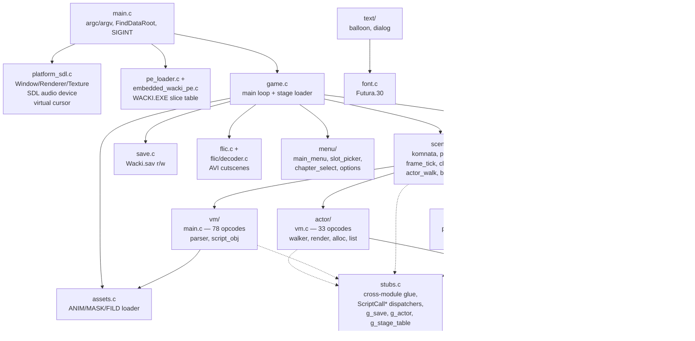

# Wacki — architektura portu

Wysokopoziomowa mapa modułów, scene lifecycle i per-frame tick.
Pary tematyczne: [script-vm.md](script-vm.md) (główna tablica
opcode'ów VM), [per-entity-vm.md](per-entity-vm.md) (per-entity VM),
[audio-pipeline.md](audio-pipeline.md),
[entity-system.md](entity-system.md), [pe-loader.md](pe-loader.md),
[asset-format.md](asset-format.md), [flic-decoder.md](flic-decoder.md).

---

## 1. Module map



Tools (separate binaries in `tools/`):

| Tool | Co robi |
|---|---|
| `dta-extract` | Wyrzuca wszystkie pliki z `Dane_NN.dta` na dysk |
| `pkv2-depack` | Dekompresuje pojedynczy blob PKv2 |
| `embed-pe-data` | Build-time — czyta `WACKI.EXE`, emituje `src/embedded_wacki_pe.c` |
| `dta-validate.sh` | Regresja byte-perfect depack (1782 SHA-256) |
| `smoke-runner.sh` | Headless smoke CI (bounded run) |
| `build-miyoo.sh` | Cross-compile w Docker dla Miyoo Mini Plus |
| `pack-miyoo.sh` | Pakuje binarkę w OnionOS Ports `.zip` |

---

## 2. Ścieżka startu

```
int main(argc, argv)
└── WackiMain
    ├── parsuj --headless / --scale / --scaler / --fullscreen
    ├── FindDataRoot           → szukaj Dane_02.dta (env, ./data, …)
    ├── PeLoaderInit           → mapuj embed PE jako passive image
    ├── PlatformInit           → SDL_Init + Window + Renderer + Texture
    ├── InitializeGameSubsystems
    │   ├── OpenDtaArchiveFile("Dane_02.dta")
    │   ├── LoadScriptFile dla Item.scr, Wacky.scr, Gadki.scr
    │   ├── PreloadCommonAssets ebek/fjej/przedm/Futura.30 + BuildStageTable
    │   └── InitializeMmTimer
    └── RunMainGameLoop
        └── RunMenuScene → na "New game" → RunGameStageLoop(flags=2)
                                            └── LoadStage(1)
                                            └── play_first_scene_demo
                                                └── play_demo_scene (per komnata)
```

---

## 3. Per-frame tick (w trakcie gry)

```mermaid
sequenceDiagram
    participant Loop as play_loop.c
    participant Tick as ProcessGameFrameTickInner
    participant Plat as platform_sdl.c
    participant VM as actor/vm.c
    participant Wlk as actor/walker.c
    participant Hit as scene/hit_test.c
    participant Snd as audio/sfx.c
    participant Rend as actor/render.c
    participant HUD as hud
    participant GR as graphics.c

    Loop->>Tick: ProcessGameFrameTickInner
    Tick->>Plat: PlatformPumpEvents — SDL events + virtual cursor d-pad poll
    Tick->>Tick: refresh_frame_deltas — g_frame_delta_ms/ticks
    Tick->>VM: EntityWalkerTick — per-entity VM
    VM->>Wlk: WALK_TO step
    VM->>Snd: TriggerFrameSfx — per atlas frame_idx change
    Tick->>Hit: PanelHitTest + ClickHitTest
    Tick->>Wlk: UpdateActorMovement
    Tick->>VM: HandleSceneInput — RMB/LMB → DispatchClickEvent
    Tick->>Rend: EntityRenderAll — Z-sort by foot_y, blit shadow
    Tick->>HUD: PaintHudOverlay
    Loop->>GR: FlushFrameToPrimary
    GR->>Plat: PlatformPresent — SDL_LockTexture + RenderCopy
    Loop->>Snd: TickMenuMusic
    Loop->>Loop: EnginePaceFrame — deadline-aware 33ms cap
```

Klawiatura w pętli głównej:
- `ESC` → quit
- `SPACE` → toggle `g_active_actor` (Ebek ↔ Fjej)
- `F5` → `QuickSaveToSlot(0)`
- `F9` → `QuickLoadFromSlot(0)`
- `F12` → menu pauzy
- `F3` → stats dump (debug build)

Frame pacing: `EnginePaceFrame(target_ms)` z `src/timer.c` to
deadline-aware sleep — śpi tylko `target_ms - work_ms`, nigdy nie
dodaje pełnego delay'a na górze nadszarpniętej klatki. Replaces
hardkodowanego `SDL_Delay(33)` w siedmiu miejscach (`play_loop.c`,
`vm/main.c` opcodes, `actor_walk.c` blocking loops, menu/dialog).

---

## 4. Cykl życia sceny

```
RunGameStageLoop(flags)
  ├── jeśli (flags & 0x02) reset script_vars, ResetInventory, LoadStage(1)
  ├── play_first_scene_demo  (port shortcut dla stage-1 demo entry)
  │
  │  dla każdej komnaty w stage:
  │   ├── LoadKomnata(id)
  │   │   ├── EntityListClearAll   (zachowane actor'y — special case)
  │   │   ├── PanelPageSwap        (reload pierwsze 6 inventory slots)
  │   │   └── RunScriptInterpreter(enter_script)
  │   ├── play_demo_scene(scene)   → main loop powyżej
  │   │   └── (loop exits gdy g_pending_komnata != 0 albo ESC)
  │   └── powtórz dla kolejnej komnaty
  │
  └── Na wyjściu:
      ├── game_over_code 1 → death AVI Dane_14.dta
      ├── game_over_code 3 → chapter-select UI (deferred)
      └── game_over_code 4 → stage-end AVI g_stage->alt_avi
```

---

## 5. Script VMs

Dwie powiązane maszyny wirtualne — szczegóły w osobnych dokumentach:

| VM | Plik | Opcode'y | Trigger | Dokument |
|---|---|---:|---|---|
| Main | `src/vm/main.c` | 78 (0x00..0x57) | DispatchClickEvent, enter_script, op 0x53 RUN_SCRIPT | [script-vm.md](script-vm.md) |
| Per-entity | `src/actor/vm.c` | 33 (0x00..0x24) | `EntityWalkerTick` raz na klatkę per active entity | [per-entity-vm.md](per-entity-vm.md) |

Wspólne globalne state:
- `g_script_vars[0x129]` — globalna tablica int32
- `g_return_reg` (= `g_script_vars[4]`) — rejestr powrotu
- `g_active_actor`, `g_cur_etap`, `g_cur_komnata`

Główny VM zarządza scenariuszem (dialogi, click handlery, enter_scripts).
Per-entity VM zarządza pojedynczymi sprite'ami (walk, anim cycle, frame
oscillation, walk-to-target). Obie używają tego samego formatu
bytecode'u (`[op:u8][len:u8][operands:(len-1)*2 LE]`).

---

## 6. Audio

Pełen opis: [audio-pipeline.md](audio-pipeline.md). Skrót:

- **Mixer** (`src/audio.c`): single `SDL_AudioDevice`, 22050 Hz S16,
  wewnętrznie zawsze stereo. 8 channels (0 = music, 1 = dialog,
  2..7 = SFX pool). Per-channel `gain_l`/`gain_r` (0..255, 128 = unity)
  do pozycyjnego pan'u.
- **mmiyoo compat**: gdy backend daje mono (Miyoo Mini Plus), mixer
  callback downmix'uje L+R → 1 channel po finalnym mixie. `s_dev_chans`
  trzyma actually-negotiated channel count.
- **`[sampl]` triggery**: `Wacky.scr` ma per-(`[etap]`,`[komnata]`)
  sekcje z `[sampl] WAV1 WAV2 ... (N,M)` definicjami. Parser
  (`src/audio/sfx.c::ParseSamplTagsForKomnata`) ładuje to do
  `g_dynamic_sfx[]`. `TriggerFrameSfx(asset, frame)` wołane gdy
  per-entity VM advance'uje klatkę — startuje/zatrzymuje wav-y
  zgodnie z tuplami.
- **Pozycyjny pan**: `SoundQueueMixForListener(lx,ly)` w
  `src/audio/sound_queue.c` zwraca packed `(R<<16)|(C<<8)|L`,
  decomposowany na `eL = L + C/2`, `eR = R + C/2` i passed do
  `PlaySfxPanned`.
- **AVI cutscene audio**: `src/flic.c` otwiera **własny** SDL_AudioDevice
  na czas odtwarzania (mixer device puszczany, bo mmiyoo nie supportuje
  multi-device), zamykany przez `audio_release()` na końcu — żeby mixer
  mógł go potem przejąć z powrotem.

---

## 7. Renderer (graphics.c)

8-bit paletted back-buffer (`g_back_shadow`, 640×480). Każdy blit
celuje w ten shadow; `FlushFrameToPrimary` uploaduje go do
`SDL_Texture` przez 8→32 palette LUT.

Path prezentacji (`PlatformPresent`):
1. `SDL_LockTexture` → mapuje GPU memory texture jako pisaczowa
2. LUT loop: `shadow[i]` (u8 indeks) + `palette_rgb[idx*3]` → ARGB pixel
3. `SDL_UnlockTexture` commit'uje
4. `SDL_RenderCopy` + `SDL_RenderPresent`

Eliminuje jedno 1.2 MB memcpy per frame vs naive `SDL_UpdateTexture`
(który robi expand do staging buffera + drugi copy). Fallback path jest
zachowany jeśli Lock zawiedzie.

Rodziny blit'ów:

| Funkcja | Use case |
|---|---|
| `BlitSpriteToBackbuffer` | flat 8bpp copy z color-key'em |
| `PaintImageToBackbuffer` | flat 8bpp copy bez color-key'a |
| `BlitSpriteScaledColorKey[Flip]` | scaled actor render (x-step LUT, perspektywa) |
| `BlitAlphaScaled[ToBackbuffer]` | alpha-plane scaled blit — 3 tryby |
| `DepackRleFrame` | rozpakuj RLE-encoded ANIM frames (kind=3) |

Tryby alpha-plane:
- 0 = nearest neighbor z x-step LUT
- 1 = 1D horizontal box filter + RGB12 kwantyzacja
- 2 = 2D box filter + RGB12 kwantyzacja

Tint przez `SetAlphaTint(bgr)` (0x808080 = identity); LUT-y auto-rebuilds
przy `InstallPalette`.

---

## 8. System Entity

Pełen opis: [entity-system.md](entity-system.md). Skrót:

- Każdy obiekt sceny = `Entity` struct ~256 B, dostęp przez byte-offsety
  z `include/entity_offsets.h` (makro `EOFF(e, off, type)`)
- Cztery wartości `kind`: 1 (atlas z verb-table), 2 (clickable sprite),
  3 (walk-behind mask / animated prop), 4 (click payload — invisible)
- Dwie równoległe listy: **render list** (Z-sorted by foot_y, blit
  back-to-front) i **click list** (hit-test targets, walked back-to-front)
- **Update table** osobno — `RegisterEntityForUpdate(e, kind, id)`
  rezerwuje logical `(kind, id)`. Lookup LIFO żeby skrypty mogły
  shadow'ować i restoreować registracje.

---

## 9. Save / load (save.c)

Pełen opis (atomic write, slot lifecycle, kompatybilność z oryginałem):
[save-file.md](save-file.md). Skrót:

```
WackiSaveFile (na dysku = w pamięci):
├── magic         "SAVE"
├── settings      WackiSettings (sound/music/voice/subtitles flags)
└── slots[10]     WackiSlot:
                  ├── stage_indicator (komnata id; 0 = empty slot)
                  ├── etap_id (1..5)
                  ├── name[30]
                  ├── script_vars[0x129]
                  ├── entity_state[0x11C]
                  ├── scene_snapshot[0x1E]
                  └── world_default_snapshot[0x2664]
```

API:
- `LoadSaveStateOrInitialize` — czyta Wacki.sav albo zero-init
- `LoadSaveSlot(idx)` — restore vars + LoadStage(etap)
- `WriteSaveFile` — dump g_save z powrotem na dysk (atomic write
  via tmp+rename, na Windows `MoveFileEx` zamiast `rename`)
- `QuickSaveToSlot(idx)` / `QuickLoadFromSlot(idx)` — F5/F9

---

## 10. Targety builda (Makefile)

| Target | Output | Uwagi |
|---|---|---|
| `make` / `make all` | `dist/wacki` + tools | Default release build |
| `make engine` | `dist/wacki` | Tylko engine |
| `make tools` | `dist/dta-extract`, `dist/pkv2-depack` | Asset tools |
| `make debug` | `dist/wacki-debug` | `-O0 -g -fsanitize=address,undefined` |
| `make test` | `dist/run-tests` | 468 testów, <1s |
| `make miyoo` | `dist/wacki-miyoo` | Cross-compile via Docker dla armv7l (Miyoo Mini Plus) |
| `make run` | (uruchamia `./dist/wacki`) | Quick test |
| `make clean` | — | Wyrzuca cały `dist/` |

Default CFLAGS: `-O2 -Wall -Wextra -Wpedantic`.
Knob `STATIC_SDL2=1` włącza static link + size opts (`-Os`, section GC,
LTO na desktopie). `TARGET=miyoo` (+ `CROSS_COMPILE=arm-linux-gnueabihf-`)
kierunkuje do ARM Cortex-A7 + NEON + hardfloat.

## 11. Flagi runtime

CLI flags i odpowiadające im env vars konsumowane przez engine. CLI
ma pierwszeństwo nad ENV. Domyślne wartości w `src/main.c` (CLI
parser + `apply_env_overrides`).

**Display / okno:**

| Flaga | Env equivalent | Efekt |
|---|---|---|
| `--scale N` | `WACKI_SCALE=N` | Window N×640 × N×480 (framebuffer dalej 640×480) |
| `--scaler MODE` | `WACKI_SCALER=MODE` | `nearest` / `linear` / `best` — jakość upskalingu |
| `--fullscreen` / `-f` | `WACKI_FULLSCREEN=1` | Borderless desktop fullscreen (F11 toggle w grze) |

**Dane gry:**

| Flaga | Env equivalent | Efekt |
|---|---|---|
| — | `WACKI_PATH=...` | Override ścieżki do `Dane_*.dta` (default: `./data/`) |

**Logging:**

| Flaga | Env equivalent | Efekt |
|---|---|---|
| `-v` / `--verbose` | — | Min level = `TRACE` (wymaga buildu z `-DWACKI_VERBOSE`) |
| `-q` / `--quiet` | — | Min level = `WARN+` (default: `INFO`) |
| — | `WACKI_INPUT_DEBUG=1` | Dump keydown/mousedown event w `platform_sdl.c` |

**CI / smoke / dev:**

| Flaga | Env equivalent | Efekt |
|---|---|---|
| `--headless` | `WACKI_HEADLESS=1` | Skip Window/Renderer/Texture (dummy SDL drivers) |
| `--start-stage N` | `WACKI_START_STAGE=N` | Dev jump prosto do etapu 1..5, pomija menu + intro |
| `--play-avi <DANE_NN.dta>` | — | Pojedyncza próba odtworzenia konkretnego AVI |
| `--test-cutscenes` | — | Batch sweep wszystkich cutscenek (`implies --no-pacing`) |
| `--no-pacing` | — | Wyłącz `SDL_Delay` pacing klatek (decode jak najszybciej) |

CI matrix: macOS arm64, Linux x86_64, Windows x86_64 (MSYS2/mingw),
Miyoo Mini Plus armv7l (Docker). Push tagu `v*` automatycznie publikuje
artefakty na GitHub Releases.
