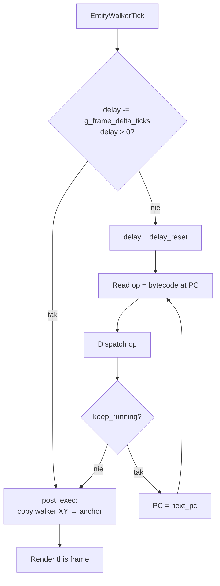

# Per-entity VM (`src/actor/vm.c`)

Każdy animowany NPC, prop czy `obiekt z atlasu` w Wackiim ma własny
mikro-program bytecode'u — ticka go ten VM raz na klatkę gry. Druga
i mniejsza maszyna obok głównego `RunScriptInterpreter` (78-opcode'owej,
opisanej w [script-vm.md](script-vm.md)).

Główny VM steruje **scenariuszem** (dialogi, skrypty wejścia, op 0x53
RUN_SCRIPT). Per-entity VM steruje **animacją + ruchem** każdego
sprite'a na ekranie.

## Format bytecode'u

Identyczny jak w głównym VM — `[op:u8][len:u8][operand:(len-1)*2 LE]`,
ale dispatcher rezyduje na pole `+0x2C` (`bytecode_slot`) struktury
Entity, z PC w polu `+0x2E`. Każdy entity ma własny PC i własny
delay counter (`+0x3C`/`+0x3E`).

## Pętla wykonania



Kluczowe pola Entity:

| Offset | Pole | Co trzyma |
|---|---|---|
| `+0x2C` | `bytecode_slot` | Wskaźnik (przez `ent_ptr_intern`) na bytecode atlasu |
| `+0x30` | `frame_idx` | Bieżąca klatka animacji do narysowania |
| `+0x32` | `pc` | Program counter, w **u16-indeksach** (nie bajtach) |
| `+0x32..+0x42` | walker state | Fixed-point pos (`X.16`/`Y.16`), target, delta |
| `+0x3A` | `state_flags` | Bit 0 `FRAME_READY`, bit 1 `WALKER_FRESH`, bit 2 `ANIM_ACTIVE` |
| `+0x3C` | `delay` | Tick-counter — gdy >0, opcode loop pomija |
| `+0x3E` | `delay_reset` | Reset value, dla cyklicznych delay'ów |
| `+0x4C`/`+0x50` | `walker_dx_rem`/`walker_dy_rem` | Fixed-point remaining distance |

Pełna lista offsetów: `include/entity_offsets.h`.

## Tabela opcode'ów (33 total)

| Op | Mnemonic | Operandy | Działanie |
|---:|---|---|---|
| 0x00 | `SET_ANCHOR_XY` | `x, y` | Anchor pos := (x, y) |
| 0x01 | `SET_ANCHOR_X` | `x` | Anchor X := x |
| 0x02 | `SET_ANCHOR_Y` | `y` | Anchor Y := y |
| 0x03 | `X_OSCILLATE` | `amp` | Sinusoidalne drganie wokół anchor X |
| 0x04 | `Y_OSCILLATE` | `amp` | Sinusoidalne drganie wokół anchor Y |
| 0x05 | `SET_POS_FROM_FRAME` | `f` | Anchor := atlas->off_drawX[f], off_drawY[f] |
| 0x06 | `SET_FRAME` | `f` | `frame_idx := f` (jednorazowy skok) |
| 0x07 | `IF_FRAME` | `f, label` | Skok do labela jeśli `frame_idx == f` |
| 0x08 | `FRAME_RANGE_CHECK` | `lo, hi` | Ustawia bit 0 jeśli `frame_idx ∈ [lo, hi]` |
| 0x09 | `SET_DELAY` | `n` | `delay := n; delay_reset := n` — cykliczny |
| 0x0A | `LABEL` | `id` | Marker dla skoków (no-op runtime) |
| 0x0B | `CLEAR_LOOP_CTRS` | — | Zeruje 3 liczniki loop'ów (+0x34/0x36/0x38) |
| 0x0C | `LOOP_A` | `n, label` | `--cnt_a`; jump do label jeśli `cnt_a < n` |
| 0x0D | `LOOP_B` | `n, label` | Jak `LOOP_A` ale cnt_b |
| 0x0E | `LOOP_C` | `n, label` | Jak `LOOP_A` ale cnt_c |
| 0x0F | `SET_RAND_FRAME` | `mod` | `frame_idx := WackiRand(mod)` |
| 0x10 | `SET_DELAY_PAUSE` | `n` | `delay := n` + yield tę klatkę |
| 0x11 | `SET_RAND_DELAY` | `mod` | `delay := WackiRand(mod)` + yield |
| 0x12 | `ADVANCE_FRAME` | `arg` | `frame_idx += arg`; wrap zależny od bitu 0x80 |
| 0x13 | `WAIT_FRAME_LABEL` | `f, label` | Wait until `frame_idx == f`, then jump |
| 0x14 | `RAND_GATE` | `mod, label` | Skok do label z prawdopodobieństwem `1/mod` |
| 0x15 | `WALK_TO_X` | `x, step` | Walker step toward target X (Y stays) |
| 0x16 | `WALK_TO_XY` | `x, y, step` | Walker step toward (x, y) |
| 0x17 | `ADD_X` | `dx` | Anchor X += dx |
| 0x18 | `ADD_Y` | `dy` | Anchor Y += dy |
| 0x1D | `STOP_TICK` | — | Zatrzymuje opcode loop, nie zmienia PC |
| 0x1E | `SUBSCRIPT_CALL` | `bytecode_va` | Wymień bytecode_slot, PC := 0 |
| 0x1F | `STOP_RESET` | — | Stop + PC := 0 (restart następną klatką) |
| 0x20 | `STOP_KEEP_PC` | — | Stop, PC zostaje |
| 0x21 | `END` | — | Jak `STOP_RESET` — synonim dla czytelności |
| 0x22 | `ENQUEUE_CLICK` | `obj, verb` | Push (obj, verb) na deferred click queue |
| 0x23 | `SWAP_ATLAS` | `id` | Zmień atlas na `(kind=1, id)` z update table |
| 0x24 | `SET_FADE` | `n` | Wypełnij `+0x26` (fade), ustaw bit 0x02 of `+0x09` |

## Charakterystyka

### Pacing przez `g_frame_delta_ticks`

VM **nie ticka opcode'ów** każdą klatkę — używa delay counter'a w
10-ms ticks (jednostka `g_frame_delta_ticks`). Na każdej klatce
delay maleje o liczbę ticków od ostatniego renderowania. Kiedy
osiągnie `≤ 0`, opcode loop wykonuje aż napotka stop opcode
(`STOP_TICK`, `STOP_RESET`, `STOP_KEEP_PC`, `END`), potem delay
restoruje się z `delay_reset` (chyba że ten = 0).

Efekt: skrypt może powiedzieć "co 5 ticków = co 50 ms wykonaj
animation step", a engine sam się dostosuje do faktycznego FPS.
Te same skrypty działają na 30 FPS PC z 1998 i na 25 FPS Cortex-A7.

### Walker fixed-point

`WALK_TO_X/XY` używa 16.16 fixed-point. Walker X (`+0x42`) i Y
(`+0x46`) to int32, ale wysokie 16 bitów (`+0x44`, `+0x48`) są
**aliasowane jako int16** — to "drawn position". Każdy krok dodaje
inc_x/inc_y (też 16.16) z pól `walker_dx_rem`/`walker_dy_rem`.
Animacja chodu (lewa/prawa/góra/dół) wybierana zewnętrznie przez
`walk_direction_for(dx, dy)` w `src/actor/walker.c`.

### Wrapping `ADVANCE_FRAME`

```c
case PVM_ADVANCE_FRAME: {
    EOFF(e, STATE_FLAGS) |= FRAME_READY;
    frame_idx += arg;
    if (arg < 0x80) {
        // looping: wrap do 0 gdy >= frame_count
        if (frame_idx >= atlas->frame_count) frame_idx = 0;
    } else {
        // one-shot: clamp do ostatniej klatki
        if (frame_idx >= atlas->frame_count) frame_idx = atlas->frame_count - 1;
    }
}
```

Bit `0x80` w argumencie wybiera "loop vs clamp". Trick z bitowym
flagowaniem w argumentcie pochodzi z oryginału.

### `SUBSCRIPT_CALL` mutuje bytecode pointer

```c
case PVM_SUBSCRIPT_CALL: {
    EOFF(e, BYTECODE_SLOT, uint32_t) = ent_ptr_intern(xlat_binary_ptr(arg));
    next_pc = 0;
    break;
}
```

Skrypt może podmienić własny bytecode w locie. Stąd loop `RunVM`
re-reads `bytecode` z pola Entity **na każdej iteracji** — caching
go na początku funkcji prowadziłby do wykonywania starego skryptu
po `SUBSCRIPT_CALL`.

### Pacing tickiem zewnętrznym

Per-entity VM nie ma swojego `SDL_Delay`. To główna pętla woła
`EnginePaceFrame(33)` raz na klatkę gry (`src/scene/play_loop.c`,
opisane w [architecture.md § 3](architecture.md#3-per-frame-tick-w-trakcie-gry)).
W tej samej klatce **wszystkie** active entity są tickane raz w
pętli `EntityWalkerTick` → `PerActorWaypointAdvanceTick` →
`UpdateActorMovement` → render.

## Stop opcodes — różnice w semantyce

| Opcode | Co robi z `keep_running` | Co robi z PC | Typowy use case |
|---|---|---|---|
| `STOP_TICK` (0x1D) | = 0 (stop) | bez zmiany | Yield 1 klatkę, kontynuuj następną |
| `STOP_RESET` (0x1F) | = 0 | := 0 | Loop animation — restart każdą klatkę |
| `STOP_KEEP_PC` (0x20) | = 0 | := pc (stay) | Czekaj zewnętrznego eventu (click, signal) |
| `END` (0x21) | = 0 | := 0 | Alias dla `STOP_RESET` w "końcowych" miejscach |

`STOP_KEEP_PC` jest kluczowy dla skryptów typu "stoję czekając aż
ktoś kliknie/event się wydarzy" — PC zostaje na `STOP_KEEP_PC`,
opcode loop nie ruszy się dopóki coś z zewnątrz nie zmieni stanu.

## Referencje w kodzie

- **Dispatcher**: `src/actor/vm.c::RunVM`
- **Per-tick caller**: `src/actor/walker.c::EntityWalkerTick`
- **Entity offsets**: `include/entity_offsets.h`
- **Test coverage**: `tests/test_per_entity_vm.c`, `tests/test_per_entity_vm_real.c`
