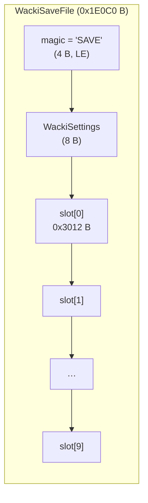
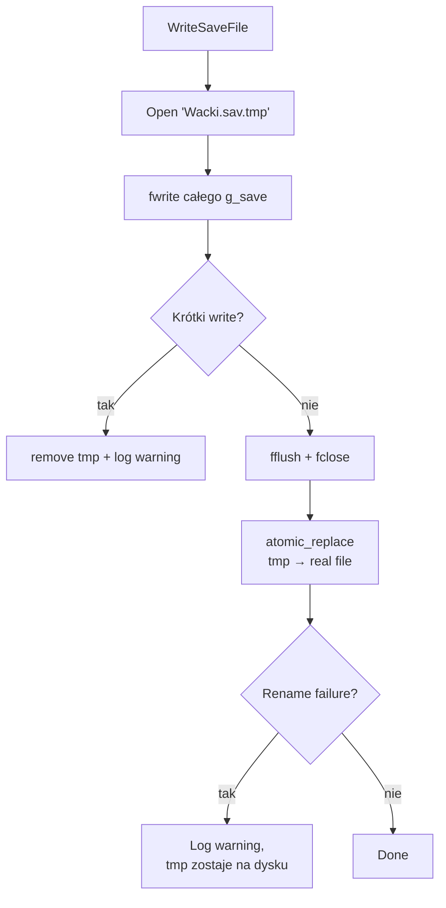
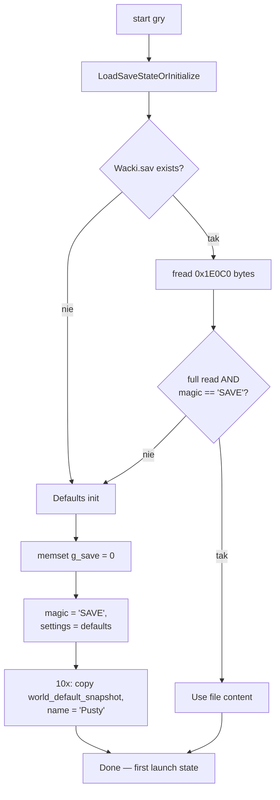

# Save / load — `Wacki.sav`

Wacki trzyma stan gry w jednym pliku `Wacki.sav` w katalogu roboczym
gry. Format jest **dosłowny dump struktury `WackiSaveFile` z RAM-u**
(123 072 bajtów = 0x1E0C0), bez nagłówków, bez kompresji. Engine
czyta go raz przy starcie, pisze po każdym save'ie (atomically),
restoruje przy load'zie.

## Layout

```
+--- offset 0 ---+--- offset 4 ---+--- offset 12 ---+
| magic 'SAVE'   | WackiSettings  | slot[0]         |
| 4 bytes        | 8 bytes        | 0x3012 bytes    |
+----------------+----------------+-----------------+
                                  | slot[1]         |
                                  | 0x3012 bytes    |
                                  +-----------------+
                                  | … slot[9]       |
                                  +-----------------+
total: 0x1E0C0 bytes (123 072)
```



### Magic + Settings

```c
#define WACKI_SAVE_MAGIC      0x45564153u   /* "SAVE" little-endian */
#define WACKI_SAVE_FILE       "Wacki.sav"

typedef struct WackiSettings {
    uint8_t video_mode, sound_on, music_on, pad0;
    uint8_t voice_on,   subtitles_on, dialogues_on, pad1;
} WackiSettings;
```

`magic` jest jedynym validator'em — niezgodność = treated as no-file,
silnik resetuje slot table i zapisuje defaults na pierwsze write.

`pad0`/`pad1` to legacy padding bytes z oryginalnej `WackiSettings`
struktury. Zostają na 0 — never written by port.

### WackiSlot — 0x3012 B per slot

```c
typedef struct WackiSlot {
    uint16_t stage_indicator;            /* +0x00: komnata id; 0 = empty slot */
    uint16_t etap_id;                    /* +0x02: stage 1..5                 */
    char     name[30];                   /* +0x04: display name (Mazovia ASCII) */
    uint32_t script_vars[0x129];         /* +0x22: 297 globalne int32         */
    uint32_t entity_state[0x11C];        /* +0x4C6: 284 per-entity state      */
    uint32_t scene_snapshot[0x1E];       /* +0x936: 30 dword scene state      */
    uint8_t  world_default_snapshot[0x2664]; /* +0x9AE: snapshot świata przed pierwszym launch'em */
} WackiSlot;
```

Compile-time invariant: `sizeof(WackiSlot) == WACKI_SLOT_SIZE` (0x3012).
Wymuszane przez `_Static_assert` w `include/wacki/types.h`.

**Co znaczą poszczególne pola:**

- `stage_indicator` = id komnaty gdzie save został zrobiony. Wartość `0`
  oznacza **empty slot** — `LoadSaveSlot` reject'uje takie. Save w
  trakcie menu (cur_komnata=0) jest odmawiany.
- `etap_id` = stage 1..5. Przy load'zie wywołuje się `LoadStage(etap)`
  **przed** restorem zmiennych (kolejność istotna, patrz niżej).
- `name` = display name w UI Save/Load menu. 30 bajtów Mazovia ASCII
  (polish DOS-era encoding, kody 0x80+). Domyślne `"Pusty"` (= "Empty").
- `script_vars` = 297 globalnych int32 zmiennych. Wszystko co script'y
  modyfikują przez op `VAR_SET`/`VAR_ADD`/itp. — flagi progressu, item
  states, dialog progres, etc.
- `entity_state` = 284 per-entity dword'y. Encodują stan poszczególnych
  obiektów na scenach (czy podniesione, czy odblokowane, itp.).
- `scene_snapshot` = 30 dwords ze stanem aktualnej sceny — pozwala
  restoreować mid-scene (np. pozycje aktorów, anim cycles).
- `world_default_snapshot` = backup oryginalnego stanu świata sprzed
  pierwszego uruchomienia. Używany do "Restart game" — restore'uje
  fresh-launch state bez restartu binarki.

## Atomic write



Bez tej sztuczki: `fopen("Wacki.sav", "wb")` **truncuje natychmiast**
(naive original implementation). Crash między open a fwrite zostawia
**zero-byte Wacki.sav**, kolejny launch dostaje "corrupt magic" i
resetuje wszystkie sloty. Atomic write via tmp+rename eliminuje to
race condition.

Cross-platform abstrakcja:

| OS | Implementacja |
|---|---|
| POSIX (macOS, Linux, Miyoo) | `rename(tmp, real)` — POSIX rename atomically replaces destination |
| Windows | `MoveFileExA(tmp, real, MOVEFILE_REPLACE_EXISTING)` — Win32 `rename` odmawia overwrite'a, więc używamy `MoveFileEx` |

Wrapper `atomic_replace` w `src/save.c` zawiera `#ifdef _WIN32` switch.
Implementacja per-platform zachowuje atomicity — między `WriteSaveFile`
a kolejnym `LoadSaveStateOrInitialize` zawsze widoczna jest dokładnie
jedna z dwóch wersji pliku.

## Boot init — `LoadSaveStateOrInitialize`



Wszystkie ścieżki kończą się z `g_save` zainicjalizowanym i `magic`
zawsze poprawnym. Defaults (gdy plik nie istnieje albo jest skorumpowany):

```c
g_save.settings = (WackiSettings){
    .video_mode   = 1,    /* default video config */
    .sound_on     = 1,    /* SFX włączone (zob. niżej) */
    .music_on     = 1,
    .voice_on     = 1,
    .subtitles_on = 1,
    .dialogues_on = 1,
};

for (i = 0; i < 10; ++i) {
    memcpy(slot[i].world_default_snapshot, g_default_world_state, 0x2664);
    memcpy(slot[i].name, "Pusty", sizeof "Pusty");
}
```

**Notka o `sound_on=1`:** oryginalna binarka shipowała z `sound_on=0`
i wymagała ręcznego włączenia przez "Solund → SFX" button w original
Win9x menu. Port nie ma tego buttona (menu options dotyczy tylko
music/voice/subtitles/dialogues/extra), więc default sound_on=1
żeby SFX działały od razu. Użytkownicy chcący zachować oryginalne
zachowanie mogą edytować byte 5 `Wacki.sav`.

## Slot restore — `LoadSaveSlot`

**Kolejność operacji ma znaczenie:**

```c
g_cur_etap = slot.etap_id;        // 1. Set etap pierwsze
LoadStage(g_cur_etap);             // 2. Stage init + load assets
g_cur_komnata = slot.stage_indicator;  // 3. Set komnata po LoadStage
memcpy(g_script_vars,    slot.script_vars,    ...);  // 4. Restore vars
memcpy(g_entity_state,   slot.entity_state,   ...);
memcpy(g_scene_snapshot, slot.scene_snapshot, ...);
```

Wcześniejsza wersja portu miała `LoadStage` **po** memcpy — `LoadStage`
inicjalizuje stage'owy enter_script który modyfikuje `script_vars` do
defaults, czyli **clobberował** restoreowany state. Quickload (F9) i
menu Load po cichu reset'owały wszystkie progress flags. Naprawione
przez przeniesienie `LoadStage` przed memcpy.

## F5 / F9 — quicksave / quickload

Slot 0 zarezerwowany konwencjonalnie dla F5/F9 cyklu — slots 1-9 są
"normal" user-facing slots. `QuickSaveToSlot(0)` i `QuickLoadFromSlot(0)`
mappowane do hotkey'ów w `play_loop.c`.

```c
int QuickSaveToSlot(uint16_t idx) {
    if (idx >= WACKI_SAVE_SLOTS) return 0;
    /* Refuse to save when game isn't in-progress — otherwise the slot
     * would be written with stage_indicator=0 and LoadSaveSlot would
     * reject it. */
    if (g_cur_etap == 0 || g_cur_komnata == 0) return 0;

    slot = &g_save.slots[idx];
    slot->stage_indicator = g_cur_komnata;
    slot->etap_id         = g_cur_etap;
    memcpy(slot->script_vars,    g_script_vars,    ...);
    memcpy(slot->entity_state,   g_entity_state,   ...);
    memcpy(slot->scene_snapshot, g_scene_snapshot, ...);
    /* Slot name owned by caller — don't clobber here. */
    WriteSaveFile();
    return 1;
}
```

Quicksave **nie nadpisuje** `slot.name` — pozwala użytkownikowi
nadać nazwę z menu Save osobno. F5 z poziomu gameplay'u używa
predefined name "Quick%u" stamped przez caller.

Quickload to po prostu `LoadSaveSlot(idx)` z empty-slot guardem.

## Edge cases

| Sytuacja | Co robi engine |
|---|---|
| `Wacki.sav` brak na dysku | Defaults init, nie pisze nic do dyskue dopóki user nie zapisze |
| `Wacki.sav` ma `magic != 'SAVE'` | Treated as corrupted → defaults init |
| `Wacki.sav` jest krótszy niż 0x1E0C0 | Treated as corrupted → defaults init |
| `Wacki.sav.tmp` zostało po crash'u | `WriteSaveFile` overwrite'uje (`fopen(tmp, "wb")` truncuje) — tmp zostaje tylko jeśli rename zawiódł |
| `LoadSaveSlot(idx)` na empty slot | Zwraca 0, nie modyfikuje state'u |
| `LoadSaveSlot(idx)` z `idx >= 10` | Zwraca 0 |
| `QuickSaveToSlot` przed start'em gry (`cur_etap == 0`) | Zwraca 0, nie zapisuje |
| Disk full / write error | `fwrite` zwraca short write → tmp jest usuwany, oryginał zostaje nietknięty |

## Test coverage

| Plik testowy | Co weryfikuje |
|---|---|
| `tests/test_save.c` | Compile-time invariants — slot size, file size, magic value, field offsets, defaults |
| `tests/test_save_io.c` | Roundtrip — write + load preserves bytes, atomic write (no leaked `.tmp`), corrupt magic falls back, short file falls back, exact file size after write |
| `tests/test_save_slot.c` | `LoadSaveSlot` semantics — copies vars/state/snapshot, set etap/komnata in right order, empty/out-of-range rejection, quicksave refuses pre-game |
| `tests/test_save_io_extended.c` | Wszystkie 10 slotów niezależnie, settings field-by-field, repeated writes preserve last, entity_state per slot, size stable |

Razem ~30 test cases pokrywające save/load path. Cross-platform —
Windows MoveFileEx vs POSIX rename obie ścieżki sprawdzone w CI.

## Compatibility z oryginalną binarką

Format `Wacki.sav` jest **byte-identyczny** z oryginałem z 1998 r. Save
zrobiony w porcie można załadować w oryginalnym `WACKI.EXE` (i vice
versa), z zastrzeżeniem:

- `world_default_snapshot[0x2664]` musi pochodzić z tej samej wersji
  silnika — to backup oryginalnego embedded state przed pierwszym
  uruchomieniem. Plik ten jest fixed z perspektywy konkretnej binarki.
- Settings differences: oryginał shipował z `sound_on=0`. Save z
  portu ma `sound_on=1` (zob. wyżej). W oryginale "Solund → SFX"
  trzeba ręcznie przełączyć po pierwszym save'ie.

`magic`, `stage_indicator`, `etap_id`, `script_vars`, `entity_state`,
`scene_snapshot` — wszystko identyczne semantically.

## Referencje w kodzie

- **Główna implementacja**: `src/save.c` — `LoadSaveStateOrInitialize`,
  `LoadSaveSlot`, `WriteSaveFile`, `QuickSaveToSlot`,
  `QuickLoadFromSlot`, `atomic_replace`
- **Type definitions**: `include/wacki/types.h` — `WackiSettings`,
  `WackiSlot`, `WackiSaveFile`, magic + size constants
- **F5/F9 wiring**: `src/scene/play_loop.c::handle_quicksave_quickload_requests`
- **Save/Load menu UI**: `src/menu/slot_picker.c` — slot list with names
- **Defaults table**: `g_default_world_state` definiowany w
  generated `src/embedded_wacki_pe.c` (extract z oryginalnego PE)
